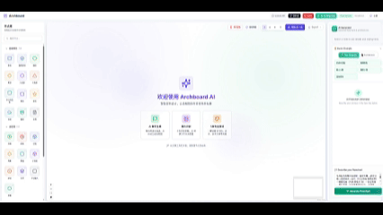
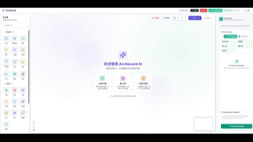
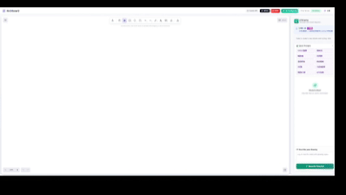
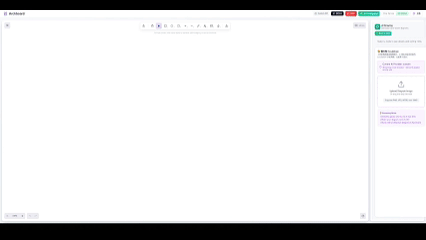

<div align="center">

# ArchBoard

**Turn Your Ideas into Clear Flowcharts**

AI-Driven Visual Thinking Tool · Make Complex Ideas Crystal Clear

[](LICENSE)
[](https://github.com/luguochang/SmartArchitect/releases)
[](https://nextjs.org/)
[](https://fastapi.tiangolo.com/)

[English](./README_EN.md) | [简体中文](./README.md)

[Online Demo](#-online-demo) · [Quick Start](#-quick-start) · [Core Philosophy](#-core-philosophy) · [Use Cases](#-use-cases) · [Features](#-features)

</div>

---

## 🌐 Online Demo

### Try It Now, No Installation Required

**Live Demo**: [https://smart-architect.vercel.app/](https://smart-architect.vercel.app/)

<div align="center">

[](https://smart-architect.vercel.app/)

</div>

### 📌 Important Notes

The project is deployed on free cloud platforms (Vercel + Render), allowing you to experience it directly without local installation.

**⚠️ Please Note:**

- 🕐 **First-time Loading**: Due to the free backend service (Render Free Plan), the backend automatically sleeps after 15 minutes of inactivity
- ⏱️ **Cold Start Time**: First visit or after long inactivity requires **30-60 seconds** to wake up the backend service
- ⚡ **Subsequent Access**: Once awake, response time is normal (< 3 seconds)
- 💾 **Data Persistence**: Canvas session data is lost after service restart (session TTL is 60 minutes, limited impact)

**Recommendations**:
- Please be patient during the first visit while the service wakes up
- If no response for a long time, please refresh the page and retry
- For frequent use, consider [local deployment](#-quick-start) following the instructions below

### 🏗️ Deployment Architecture

```
┌─────────────────┐         ┌─────────────────┐
│   Vercel        │         │   Render        │
│  (Frontend)     │────────▶│  (Backend API)  │
│  Next.js 14     │  HTTPS  │  FastAPI        │
│  Global CDN     │         │  Python 3.12    │
└─────────────────┘         └─────────────────┘
```

**Deployment Cost**: Completely Free ($0/month)

**Detailed Deployment Guide**: See [docs/DEPLOYMENT_GUIDE.md](./docs/DEPLOYMENT_GUIDE.md)

---

## 💡 What is ArchBoard?

Have you ever experienced these situations:

- 💭 **You have an idea, but can't explain it clearly**
- 🌀 **Business processes are too complex to organize**
- 🤯 **During technical discussions, everyone has different understanding**
- 📝 **Meeting notes are messy and hard to review later**

**ArchBoard solves these problems.**

> Describe your idea in natural language → AI generates flowchart → Refine as you review → Clarity emerges

Not a drawing tool, but a **thinking companion**.

---

## 🎯 Core Philosophy

### Three Steps from Chaos to Clarity

```
Step 1: Brain Dump          Step 2: AI Visualization      Step 3: Iterative Refinement

"I want to build a user    →    [Generate Flowchart]    →    "Add SMS verification"
 registration, login,              ┌─────────┐                  [Auto-adjust]
 password reset..."                │ Register │                      ↓
                                   │ Login    │              Clear Action Plan
 Fuzzy unstructured idea           └─────────┘
```

### Core Value

Not about "how pretty it looks", but **"how clear you think"**.

- ✅ **Rapid Visualization** - Turn ideas into diagrams in 3 minutes, no design skills needed
- ✅ **Reveal Blind Spots** - Seeing the flowchart reveals: "I didn't consider this, there's an issue there"
- ✅ **Unified Understanding** - Team discussions around the same diagram, everyone aligned
- ✅ **Continuous Refinement** - Conversational adjustments, ideas get clearer with each iteration

---

## 🎬 Use Cases

### 1. Product Managers: Clarify Business Processes

**Scenario**: New requirement arrives, you have a rough idea but details are unclear

**Traditional Approach**:
- Open Axure/Moqups, struggle with which shape to use
- After hours of drawing, realize the flow is wrong, start over
- Spent 2 hours on diagrams, core business logic still unclear

**With ArchBoard**:

```
You: "Design an e-commerce flash sale flow, user clicks the buy button..."

AI: [Generates base flow in 3 seconds]
    User Click → Check Stock → Deduct Inventory → Create Order → Payment

You: "Wait, inventory deduction needs locking to prevent overselling"

AI: [Adjusts immediately]
    Check Stock → Redis Lock → Deduct Inventory → Create Order

You: "Payment failure should restore inventory"

AI: [Adds exception handling]
    Payment Failed → Release Lock → Restore Inventory → Return Error
```

**Result**: In 10 minutes, both the happy path and edge cases are crystal clear.

---

### 2. Engineers: Design Technical Solutions

**Scenario**: Designing a new system, tech stack and architecture undecided

**Traditional Approach**:
- Write Word documents with dry text descriptions
- Review meetings turn into everyone talking past each other
- After the review, still unclear how to implement

**With ArchBoard**:

```
You: "Design a short video recommendation system with data collection,
      feature extraction, recall, and ranking"

AI: [Generates initial architecture]
    [Data Collection] → [Feature Engineering] → [Recall Service] → [Ranking] → [Client]

You: "Split recall into 3 services: trending, collaborative filtering, content-based"

AI: [Adjusts architecture]
                        ┌─ Trending Recall ─┐
    Feature Eng → ├─ Collaborative  ─┤ → Ranking → Client
                        └─ Content Recall ─┘

You: "Add real-time data stream with Kafka + Flink"

AI: [Adds real-time pipeline]
    User Behavior → Kafka → Flink Processing → Redis → Recall Service
```

**Result**: Solution is visually clear, reviews focus on the diagram, efficiency 5x improved.

---

### 3. Entrepreneurs: Structure Business Models

**Scenario**: You have a startup idea, but the business loop isn't fully thought through

**Traditional Approach**:
- Write business plan with text descriptions, investors don't get it
- Explain for ages, people still don't understand
- Can't even articulate your own revenue model

**With ArchBoard**:

```
You: "Build an online education platform where teachers join and students pay for courses"

AI: [Generates base flow]
    Teacher Onboard → Upload Course → Student Purchase → Platform Commission

You: "How do teachers get students? Need referral mechanism"

AI: [Adds referral flow]
    Teacher Promote → Student Signup (with referral code) → Purchase → Teacher Gets Commission

You: "How do students know course quality? Need reviews and previews"

AI: [Adds quality assurance]
    Course Details → Preview Clips → Student Reviews → Purchase Decision
```

**Result**: Business loop is visually clear, gaps are immediately obvious.

---

### 4. Operations: Design Campaign Flows

**Scenario**: Planning a marketing campaign, need to align flow with tech and product teams

```
You: "Double 11 campaign, users get coupons, discounts, bundle deals, checkout"

AI: [Generates campaign flow]
    Enter Page → Claim Coupon → Add Items → Bundle Deal → Checkout

You: "Need to handle out-of-stock scenarios"

AI: [Adds exception handling]
    Add Item → Check Stock → Out of Stock → Recommend Alternatives

You: "Failed payments should return coupons"

AI: [Completes refund logic]
    Payment Failed → Return Coupon → Keep Cart → User Retry
```

**Result**: Campaign flow, exception handling, technical requirements - all aligned.

---

### 5. Students/Teachers: Understand Algorithm Logic

**Scenario**: Learning complex algorithms, code is hard to understand, need visualization

```
You: "Show the execution flow of quicksort algorithm"

AI: [Generates algorithm flow]
    Select Pivot → Partition (less/greater) → Recursive Sort → Merge

You: "Show the partition process in detail"

AI: [Expands details]
    Iterate Array → Compare Element → Move Left if Less → Move Right if Greater → Swap
```

**Result**: Algorithm logic is crystal clear, no need to memorize blindly.

---

## ✨ Core Features

### 1. Conversational Generation - Draw by Chatting

No need to learn complex tools, **describe your idea, AI draws for you**.

```
You: "Draw a user registration flow"
AI: [Generates base version]

You: "Add phone verification code"
AI: [Auto-adds verification step]

You: "If wrong code 3 times, lock account for 30 minutes"
AI: [Adds exception handling]
```

**Supported AI Models:**
- Google Gemini (recommended, generous free tier)
- OpenAI GPT-4 (most accurate understanding)
- Claude 3.5 (clearest logic)
- SiliconFlow (fast access in China)
- Custom models (bring your own)

### 2. Dual Canvas System - Structured + Freeform

**Flow Canvas**: Structured flowcharts for formal scenarios
- Standard node types (API, Service, Database...)
- Clean connections
- Auto-layout
- Best for: Technical designs, business processes, system architecture

**Excalidraw**: Hand-drawn whiteboard for brainstorming
- Freeform sketching
- Hand-drawn aesthetics
- Infinite canvas
- Best for: Early ideation, workshops, quick sketches

#### Why Node-Based Canvas?

Unlike traditional drawing tools, **ArchBoard's Flow Canvas is built on node architecture (React Flow)**, bringing revolutionary interaction:

**🔗 True Node Connectivity**
- Traditional tools: Drag a box + drag a line, they're just "drawn together", no relationship
- **ArchBoard**: Drag nodes, connections auto-follow; delete nodes, related connections auto-clean
- **Result**: Diagrams stay consistent, no "orphaned lines" or "broken connections"

**⚡ Real-Time Reactive Updates**
- Traditional tools: After moving nodes, manually adjust each line's start/end points
- **ArchBoard**: Based on React Virtual DOM, connections auto-redraw when nodes move, silky smooth
- **Result**: Freely adjust layout without worrying about "messy diagrams"

**🎯 Programmatic Control**
- Traditional tools: Each element is an independent "drawn shape"
- **ArchBoard**: Nodes and edges are programmable data structures, support batch operations, import/export, version control
- **Result**: Manage diagrams like code, supports Git version control, automated generation

**🚀 Performance Optimization**
- Traditional tools: Lag when canvas has many elements (full re-render)
- **ArchBoard**: Built-in virtualization, only renders nodes in visible area
- **Result**: Even 100+ node complex diagrams stay fluid

**Simply put**:
> Traditional tools are "drawing" → What you draw is what you get
> **ArchBoard is "modeling"** → Nodes and relationships are alive, maintain consistency automatically

This is why ArchBoard is better for "thinking organization" not just "drawing".

### 3. Image Recognition - Whiteboard Photos to Flowcharts

After meetings, take a photo of the whiteboard, upload it, AI automatically recognizes and generates editable flowcharts.

Never worry about losing whiteboard content again.

### 4. Multi-Theme System - Adapt to Any Scenario

12+ carefully tuned color schemes:
- **Presentations**: Geist, Default (professional, clean)
- **Tech Talks**: Dracula, Monokai (dark mode, easy on eyes)
- **Long Editing Sessions**: Nord, Solarized (soft colors)
- **Documentation Screenshots**: GitHub, Material (high contrast)

---

## 🎬 Feature Demos

### Core Functionality Showcase

<div align="center">



*ArchBoard Complete Feature Showcase: From Conversational Generation to Visual Editing*

</div>

---

### Featured Capabilities

<table>
<tr>
<td width="50%" align="center">

<p><b>🏗️ Architecture Generation</b></p>
<p><i>Intelligently identify system components, auto-generate technical architecture diagrams</i></p>
</td>
<td width="50%" align="center">

<p><b>✏️ Excalidraw Integration</b></p>
<p><i>Hand-drawn style whiteboard, supports freeform creation and collaboration</i></p>
</td>
</tr>
<tr>
<td width="50%" align="center">

<p><b>📸 Intelligent Image Recognition</b></p>
<p><i>Upload whiteboard photos, AI automatically converts to editable flowcharts</i></p>
</td>
<td width="50%" align="center">
<p><b>🎨 More Features</b></p>
<p><i>• Multi-theme switching<br>• Code sync editing<br>• Multi-format export<br>• RAG knowledge base</i></p>
</td>
</tr>
</table>

---

## 🚀 Quick Start

### Run Locally in 5 Minutes

```bash
# 1. Clone the repository
git clone https://github.com/luguochang/SmartArchitect.git
cd SmartArchitect

# 2. Start (one-command script)
# Windows:
start-dev.bat

# Linux/Mac:
./start-dev.sh

# 3. Access
Open browser and visit http://localhost:3000
```

### Configure AI (Optional)

```bash
# Create .env file in backend directory
cd backend
echo "GEMINI_API_KEY=your_key" > .env
```

**Works without configuration**: You can enter API keys dynamically in the UI.

---

## 💡 Usage Tips

### How to Write Good Prompts?

**✅ Good Prompt** (clear description, step-by-step)

```
Design a food delivery order flow:

1. User side:
   - Browse restaurants and dishes
   - Add to cart
   - Submit order (select address, notes)
   - Choose payment method

2. Restaurant side:
   - Receive order notification
   - Confirm order (can reject)
   - Prepare food
   - Notify delivery

3. Driver side:
   - Accept order
   - Pick up at restaurant
   - En route to delivery
   - Complete order

4. Exception handling:
   - Restaurant rejects → Refund
   - Driver timeout → Auto-reassign
   - User cancels → Determine cancellation fee
```

**❌ Poor Prompt** (vague, no details)

```
Draw a food delivery flow
```

### Iterative Refinement Strategy

```
Round 1: Quick base version
"Draw a user login flow"

Round 2: Add core logic
"Add phone verification code login"

Round 3: Complete exception handling
"Lock account after 3 wrong verification codes"

Round 4: Optimize user experience
"Add auto-login (remember password for 7 days)"

Round 5: Polish layout
"Align nodes for clearer layout"
```

**Key**: Don't try to think of everything at once, refine as you generate.

---

## 🛠️ Tech Stack

**Frontend**
- Next.js 14 + TypeScript 5.7
- React Flow 11 (Flow Canvas)
- Excalidraw 0.18 (Whiteboard)
- Tailwind CSS 3.4 (Styling)

**Backend**
- FastAPI 0.115 + Python 3.12
- Multi-AI model integration (Gemini, GPT-4, Claude)
- RESTful API

---

## 🗺️ Roadmap

### ✅ Completed (v0.5)

- [x] Flow Canvas drag-and-drop editing
- [x] Excalidraw whiteboard
- [x] AI conversational generation (multi-model)
- [x] Image recognition
- [x] 12+ theme system
- [x] BPMN node support

### 🚧 Planned (v0.6+)

**Collaboration Features**
- [ ] Real-time multi-user editing (like Figma)
- [ ] Comments and annotations
- [ ] Version history

**AI Capability Enhancement**
- [ ] Flow optimization suggestions (AI identifies issues)
- [ ] Auto-complete missing steps
- [ ] Risk point alerts

**Knowledge Base**
- [ ] Save common templates
- [ ] Team template library
- [ ] Smart recommendation of similar flows

**Enhanced Export**
- [ ] High-res PNG/SVG
- [ ] Multi-page PDF export
- [ ] PowerPoint presentations

---

## 🤝 Contributing

Issues and PRs are welcome!

### How to Contribute

1. Fork this repository
2. Create feature branch (`git checkout -b feature/amazing-idea`)
3. Commit changes (`git commit -m 'feat: add amazing idea'`)
4. Push branch (`git push origin feature/amazing-idea`)
5. Submit Pull Request

---

## ❓ FAQ

<details>
<summary><b>1. Why isn't the AI generating my idea accurately?</b></summary>

**Reason**: Prompt is too simple or vague.

**Solution**:
- Describe step-by-step (first step, second step...)
- Specify roles (user, merchant, system)
- State conditions (if...then...)
- Add technical details (use Redis, MySQL)

See [Usage Tips](#-usage-tips) for more.
</details>

<details>
<summary><b>2. How complex flows can it handle?</b></summary>

- ✅ Simple flows (5-10 nodes): Instant generation
- ✅ Medium complexity (20-30 nodes): Works great
- ⚠️ Super complex (50+ nodes): Recommend splitting into sub-flows

**Tip**: Draw main flow first, then expand sub-flows gradually.
</details>

<details>
<summary><b>3. Does it support collaboration?</b></summary>

Current version doesn't support real-time collaboration, but you can:
- Export images to share with team
- Export JSON files to share
- Manage diagram versions with Git

Real-time collaboration is planned for v0.6.
</details>

<details>
<summary><b>4. What's the difference from other flowchart tools?</b></summary>

| Tool | Positioning | Core Feature |
|------|------------|-------------|
| **ArchBoard** | Thinking companion | AI conversational generation, rapid idea visualization |
| ProcessOn | Online drawing tool | Manual drag-and-drop, rich templates |
| Visio | Professional diagramming | Powerful features, steep learning curve |
| Mermaid | Code-to-diagram | Developer-friendly, syntax barrier |
| Excalidraw | Hand-drawn whiteboard | Freeform sketching, lacks AI |

**ArchBoard's Uniqueness**:
- ✅ Lower barrier: Talk to draw, no tool learning
- ✅ Fast iteration: Conversational refinement, ideas get clearer
- ✅ Dual engine: Structured + freeform, flexible switching
</details>

---

## 📜 License

MIT License - Free to use, modify, and commercialize

---

## 🙏 Acknowledgments

- [React Flow](https://reactflow.dev/) - Powerful node canvas
- [Excalidraw](https://excalidraw.com/) - Elegant hand-drawn whiteboard
- [FastAPI](https://fastapi.tiangolo.com/) - Modern Python framework
- [Next.js](https://nextjs.org/) - Excellent React framework

Thanks to all contributors!

---

## 📬 Contact Us

- **GitHub Issues**: [Ask questions / Suggest features](https://github.com/luguochang/SmartArchitect/issues)
- **GitHub Discussions**: [Discussion forum](https://github.com/luguochang/SmartArchitect/discussions)

---

## ⭐ Give Us a Star!

If ArchBoard helped you clarify your thinking, please give us a Star 🌟

[](https://star-history.com/#luguochang/SmartArchitect&Date)

---

<div align="center">

**Make Ideas Clear, Make Communication Efficient**

Made with ❤️ by [ArchBoard Team](https://github.com/luguochang/SmartArchitect/graphs/contributors)

[⬆️ Back to Top](#archboard)

</div>
