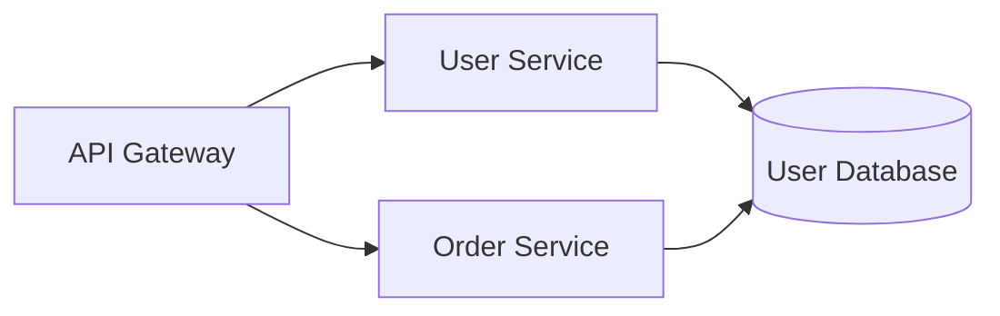

# SmartArchitect AI - 快速开始指南

**版本:** 0.4.0
**更新日期:** 2026-01-07

---

## 环境要求

- **Node.js** 18+ (推荐 20+)
- **Python** 3.10+ (推荐 3.12+)
- **包管理器** npm/yarn/pnpm
- **操作系统** Windows/Linux/macOS

---

## 完整安装步骤

### 1. 克隆项目

```bash
git clone https://github.com/luguochang/SmartArchitect.git
cd SmartArchitect
```

### 2. 安装前端依赖

```bash
cd frontend
npm install
```

安装的主要依赖：
- Next.js 14.2.18
- React 19.0.0
- React Flow 11.11.4
- Monaco Editor 4.6.0
- Tailwind CSS 3.4.17
- Zustand 4.5.5

### 3. 安装后端依赖

```bash
cd ../backend
python -m venv venv

# Windows
venv\Scripts\activate

# Linux/Mac
source venv/bin/activate

pip install -r requirements.txt
```

安装的主要依赖：
- FastAPI 0.115.6
- Pydantic 2.10.4
- ChromaDB 0.4.22
- sentence-transformers 2.3.1
- python-pptx 0.6.23
- AI SDK (google-generativeai, openai, anthropic)

### 4. 配置环境变量（可选）

```bash
# 后端配置
cd backend
touch .env  # Linux/Mac
# 或 type nul > .env  # Windows

# 编辑 .env 文件，添加以下配置（可选）
```

**.env 示例：**
```bash
# API 服务配置
API_HOST=0.0.0.0
API_PORT=8000
API_RELOAD=True

# CORS 配置
CORS_ORIGINS=["http://localhost:3000", "http://127.0.0.1:3000"]

# AI 模型 API Keys（可选，可在运行时通过 UI 配置）
GEMINI_API_KEY=your_gemini_api_key
OPENAI_API_KEY=your_openai_api_key
ANTHROPIC_API_KEY=your_anthropic_api_key
```

**注意:** API Keys 可以不在 .env 中配置，可在应用运行时通过 UI 界面动态配置。

---

## 启动服务

### 方式一：使用启动脚本（推荐）

**Windows:**
```bash
start-dev.bat
```

**Linux/Mac:**
```bash
chmod +x start-dev.sh  # 首次运行需要添加执行权限
./start-dev.sh
```

启动脚本会自动：
1. 激活 Python 虚拟环境
2. 启动后端服务（http://localhost:8000）
3. 启动前端服务（http://localhost:3000）

### 方式二：分别启动（用于开发调试）

**终端 1 - 启动后端：**
```bash
cd backend

# 激活虚拟环境
# Windows: venv\Scripts\activate
# Linux/Mac: source venv/bin/activate

python -m app.main
```

后端启动成功后会显示：
```
INFO:     Started server process [PID]
INFO:     Uvicorn running on http://0.0.0.0:8000
INFO:     Application startup complete
```

**终端 2 - 启动前端：**
```bash
cd frontend
npm run dev
```

前端启动成功后会显示：
```
  ▲ Next.js 14.2.18
  - Local:        http://localhost:3000
  - Ready in 2.5s
```

---

## 访问应用

启动成功后，可以访问：

- **前端应用:** http://localhost:3000
- **后端 API:** http://localhost:8000
- **API 交互文档:** http://localhost:8000/docs (Swagger UI)
- **API 文档 (备选):** http://localhost:8000/redoc (ReDoc)

---

## 功能使用指南

### 1. 基础画布操作

#### 添加节点
1. 点击左侧工具栏的图标：
   - 🔷 **API** 节点（蓝色）
   - 💜 **Service** 节点（紫色）
   - 🟢 **Database** 节点（绿色）
2. 节点会自动添加到画布中心
3. 拖拽节点到合适的位置

#### 连接节点
1. 将鼠标悬停在节点上，会显示连接点
2. 从一个节点的连接点拖拽到另一个节点
3. 连接会自动创建
4. 右侧代码编辑器会自动更新 Mermaid 代码

#### 删除节点或连接
- **删除节点:** 选中节点后按 `Delete` 或 `Backspace` 键
- **删除连接:** 选中连接线后按 `Delete` 或 `Backspace` 键

### 2. 代码编辑

#### 编辑 Mermaid 代码
1. 在右侧 **Monaco Editor** 中直接编辑 Mermaid 代码
2. 点击 **Apply** 按钮应用更改
3. 画布会根据代码自动更新

#### Mermaid 语法示例


### 3. AI 视觉分析（Phase 2）

#### 上传架构图片
1. 点击左侧工具栏的 📸 **图片上传** 按钮
2. 选择或拖拽架构图片（支持 PNG、JPG、JPEG）
3. 选择 AI 提供商：
   - **Gemini** - Google Gemini 2.5 Flash（推荐，默认）
   - **OpenAI** - GPT-4 Vision
   - **Claude** - Anthropic Claude
   - **Custom** - 自定义 API 端点
4. 输入 API Key（如已在设置中配置可跳过）
5. 点击 **Analyze** 按钮
6. AI 会分析图片并自动生成节点和连接

#### 配置 AI 模型
1. 点击左侧底部的 ⚙️ **设置** 图标
2. 选择模型提供商
3. 输入 API Key 和模型名称
4. 点击 **Save** 保存配置

### 4. 架构重构建议（Phase 3）

#### 使用 Prompter
1. 点击左侧工具栏的 ✨ **Prompter** 按钮
2. 选择预设场景：
   - **Microservices** - 微服务架构转换
   - **Performance** - 性能优化建议
   - **Security** - 安全加固建议
   - **Custom** - 自定义提示词
3. 输入 API Key（如需）
4. 点击 **Execute** 执行
5. AI 会分析当前架构并给出优化建议

#### 主题切换
1. 点击右上角的 🎨 **主题** 图标
2. 选择喜欢的主题（12+ 可选）：
   - Light 主题：Default, Geist, GitHub, Nord, etc.
   - Dark 主题：Dark, Dracula, Monokai, Nord Dark, etc.

### 5. RAG 知识库（Phase 4）

#### 上传文档
1. 点击左侧工具栏的 📄 **文档** 按钮
2. 点击 **Upload New Document** 选择文件
3. 支持的格式：
   - PDF (.pdf)
   - Markdown (.md)
   - Word 文档 (.docx)
4. 文档会被自动分块并向量化存储

#### 搜索文档
1. 在文档对话框中输入搜索关键词
2. 点击 **Search** 按钮
3. 系统会返回最相关的文档片段

#### 管理文档
- **查看列表:** 文档对话框自动显示所有已上传文档
- **删除文档:** 点击文档旁的删除按钮

### 6. 导出功能（Phase 4）

#### 导出选项
1. 点击左侧工具栏的 📤 **导出** 按钮
2. 选择导出格式：

**PowerPoint 演示文稿:**
- 自动生成 4 页专业 PPT
- 包含封面、架构概览、详细图表、总结
- 下载后可用 Microsoft PowerPoint 或 WPS 打开

**Slidev 幻灯片:**
- 生成 Markdown 格式幻灯片
- 可用 Slidev 框架渲染
- 支持 Mermaid 图表嵌入

**演讲稿:**
- 选择时长：30 秒、2 分钟、5 分钟
- AI 自动生成结构化演讲内容
- 包含开场、主体、总结

---

## 常见问题 (FAQ)

### 前端无法连接后端

**症状:** 前端显示网络错误或 CORS 错误

**解决方案:**
1. 确保后端服务已启动（访问 http://localhost:8000 检查）
2. 检查 CORS 配置：`backend/app/core/config.py`
   ```python
   CORS_ORIGINS = ["http://localhost:3000", "http://127.0.0.1:3000"]
   ```
3. 清除浏览器缓存并刷新页面

### Python 依赖安装失败

**症状:** `pip install -r requirements.txt` 报错

**解决方案:**
1. 确保 Python 版本 >= 3.10
   ```bash
   python --version
   ```
2. 升级 pip 到最新版本
   ```bash
   python -m pip install --upgrade pip
   ```
3. 如果是 ChromaDB 安装失败，尝试：
   ```bash
   pip install chromadb==0.4.22 --no-cache-dir
   ```

### Node.js 依赖安装失败

**症状:** `npm install` 报错

**解决方案:**
1. 确保 Node.js 版本 >= 18
   ```bash
   node --version
   ```
2. 清理 npm 缓存
   ```bash
   npm cache clean --force
   rm -rf node_modules package-lock.json  # 删除现有依赖
   npm install
   ```
3. 尝试使用 yarn 或 pnpm
   ```bash
   yarn install
   # 或
   pnpm install
   ```

### RAG 首次查询很慢

**症状:** 第一次搜索文档时等待 20-30 秒

**原因:** 这是正常现象，因为 sentence-transformers 需要下载和加载嵌入模型（约 80MB）

**解决方案:**
- 后续查询会快速响应（100-200ms）
- 如需提速，可在服务器启动时预加载模型（参考 `TODO.md`）

### 图片上传后 AI 分析失败

**症状:** 上传图片后显示错误

**可能原因:**
1. 未配置 API Key
2. API Key 无效或额度不足
3. 图片格式不支持
4. 图片文件过大

**解决方案:**
1. 检查 AI 提供商的 API Key 是否正确
2. 确保图片格式为 PNG/JPG/JPEG
3. 尝试压缩图片到 5MB 以下
4. 查看浏览器控制台和后端日志获取详细错误

### 测试失败

**症状:** 运行 `pytest tests/` 时有测试失败

**解决方案:**
1. 确保虚拟环境已激活
2. 安装测试依赖
   ```bash
   pip install -r test-requirements.txt
   ```
3. 运行测试并查看详细输出
   ```bash
   pytest tests/ -v --tb=short
   ```
4. 参考 `TEST_COVERAGE_REPORT.md` 了解测试状态

---

## 开发技巧

### 热重载

**后端热重载:**
- FastAPI 默认开启热重载（`API_RELOAD=True`）
- 修改 Python 代码后自动重启服务

**前端热重载:**
- Next.js 自动热重载
- 修改 React 组件后浏览器自动刷新

### API 文档

访问 http://localhost:8000/docs 可以：
- 查看所有 27 个 API 端点
- 在线测试 API 调用
- 查看请求/响应模型定义

### 调试模式

**后端调试:**
```bash
# 在 VS Code 中配置 launch.json
{
  "name": "Python: FastAPI",
  "type": "python",
  "request": "launch",
  "module": "uvicorn",
  "args": ["app.main:app", "--reload"],
  "cwd": "${workspaceFolder}/backend"
}
```

**前端调试:**
- 使用浏览器开发者工具
- Next.js 自带 Source Maps 支持

### 运行测试

```bash
# 运行所有测试
cd backend
pytest tests/ -v

# 运行单个测试文件
pytest tests/test_api.py -v

# 运行特定测试
pytest tests/test_api.py::test_rag_workflow -v

# 生成覆盖率报告
pytest tests/ --cov=app --cov-report=html
# 打开 htmlcov/index.html 查看详细报告
```

---

## 下一步

- 📚 查看 [架构文档](./architecture.md) 了解技术细节
- 🔍 查看 [实现总结](./implementation-summary.md) 了解开发历程
- 📖 查看 [CLAUDE.md](../CLAUDE.md) 了解开发者指南
- 📊 查看 [SYSTEM_REVIEW.md](../SYSTEM_REVIEW.md) 了解生产环境评估
- 🧪 查看 [TEST_COVERAGE_REPORT.md](../TEST_COVERAGE_REPORT.md) 了解测试情况
- 📝 查看 [TODO.md](../TODO.md) 了解未来规划

---

## 技术支持

如遇到问题，请检查：
1. **GitHub Issues:** https://github.com/luguochang/SmartArchitect/issues
2. **后端日志:** 查看终端输出
3. **前端日志:** 查看浏览器控制台（F12）
4. **文档:** 参考 `docs/` 目录下的其他文档

**项目信息:**
- 版本：0.4.0
- 状态：Phase 4 Complete - Production Ready
- 测试覆盖率：97%
- API 端点：27 个
