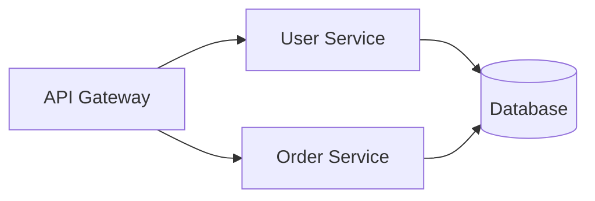

<div align="center">

# SmartArchitect AI

### AI-Powered Architecture Design Platform

Transform your architectural diagrams into editable, interactive flowcharts with the power of AI

[](https://github.com/luguochang/SmartArchitect)
[](LICENSE)
[](https://nextjs.org/)
[](https://fastapi.tiangolo.com/)
[](https://reactflow.dev/)

[Features](#features) • [Demo](#demo) • [Quick Start](#quick-start) • [Tech Stack](#tech-stack) • [Documentation](#documentation) • [Roadmap](#roadmap)

</div>

---

## Overview

**SmartArchitect AI** is a full-stack platform that revolutionizes architecture design by seamlessly integrating visual diagram editing with AI-powered analysis. Create, visualize, and refine system architectures using an intuitive Flow Canvas and Excalidraw integration, powered by cutting-edge AI models.

### Why SmartArchitect?

- **🎨 Dual Canvas System**: Choose between structured Flow Canvas or freeform Excalidraw whiteboarding
- **🤖 AI-Powered Generation**: Convert natural language descriptions into professional flowcharts instantly
- **🔄 Bidirectional Sync**: Edit visually or via Mermaid code - changes sync automatically
- **🎭 Multi-Provider AI**: Support for Gemini, OpenAI, Claude, SiliconFlow, and custom endpoints
- **📊 Professional Export**: Export to PowerPoint, Slidev, or speech scripts (coming soon)

---

## Features

### 🎯 Core Features (v0.5.0)

#### Interactive Flow Canvas
- **Drag-and-drop interface** powered by React Flow
- **Custom node types**: API, Service, Database, Cache, Client, and more
- **BPMN support**: Start events, end events, tasks, gateways
- **Real-time editing** with instant visual feedback
- **Auto-layout algorithms** using dagre

<div align="center">
  
  <p><i>Placeholder for Flow Canvas demo GIF</i></p>
</div>

#### Excalidraw Integration
- **Whiteboard-style drawing** for freeform architecture brainstorming
- **AI scene generation** from text prompts
- **Hand-drawn aesthetic** with professional diagram capabilities
- **Export to PNG/SVG** for documentation

<div align="center">
  
  <p><i>Placeholder for Excalidraw demo GIF</i></p>
</div>

#### Natural Language to Flowchart
- **Chat Generator**: Describe your architecture in plain language
- **Smart Templates**: Pre-built templates for common scenarios (OOM troubleshooting, order processing, algorithms)
- **Streaming responses**: Real-time generation feedback
- **Diagram types**: Support for both flowcharts and architecture diagrams

#### AI Vision Analysis
- **Upload architecture images** and convert to editable diagrams
- **Multi-provider support**: Gemini 2.5 Flash (default), GPT-4 Vision, Claude
- **Component detection**: Automatically identify services, databases, APIs
- **Architecture optimization suggestions**

#### Code-First Workflow
- **Mermaid syntax** for architecture-as-code
- **Monaco Editor** with syntax highlighting
- **Bidirectional sync**: Canvas ↔ Code
- **Export/Import** as Mermaid files

#### Theme System
- **12+ professional themes** (Light, Dark, Dracula, Nord, Monokai, GitHub, Geist)
- **Real-time switching** with CSS variables
- **Vercel/Linear-inspired** aesthetics

---

## Demo

### Quick Overview

```bash
# Start both frontend and backend with one command
./start-dev.sh  # Linux/Mac
start-dev.bat   # Windows
```

Visit [http://localhost:3000](http://localhost:3000) to see SmartArchitect in action!

### Screenshots

<div align="center">
  <table>
    <tr>
      <td align="center">
        
        <br>Flow Canvas View
      </td>
      <td align="center">
        
        <br>Excalidraw Mode
      </td>
    </tr>
    <tr>
      <td align="center">
        
        <br>Chat Generator
      </td>
      <td align="center">
        
        <br>Theme System
      </td>
    </tr>
  </table>
  <p><i>Placeholders for project screenshots - add actual screenshots here</i></p>
</div>

---

## Quick Start

### Prerequisites

- **Node.js** 18+ (recommended 20+)
- **Python** 3.10+ (recommended 3.12+)
- **npm/yarn/pnpm**

### Installation

1. **Clone the repository**
```bash
git clone https://github.com/luguochang/SmartArchitect.git
cd SmartArchitect
```

2. **Install frontend dependencies**
```bash
cd frontend
npm install
```

3. **Install backend dependencies**
```bash
cd ../backend
python -m venv venv

# Activate virtual environment
# Windows:
venv\Scripts\activate
# Linux/Mac:
source venv/bin/activate

pip install -r requirements.txt
```

4. **Configure environment (optional)**
```bash
cd backend
cp .env.example .env  # Edit with your API keys
```

### Running the Application

**Option 1: One-command startup (Recommended)**
```bash
# From project root
./start-dev.sh  # Linux/Mac
start-dev.bat   # Windows
```

**Option 2: Manual startup**
```bash
# Terminal 1 - Backend
cd backend
python -m app.main

# Terminal 2 - Frontend
cd frontend
npm run dev
```

### Access the Application

- **Frontend**: [http://localhost:3000](http://localhost:3000)
- **Backend API**: [http://localhost:8003](http://localhost:8003)
- **API Documentation**: [http://localhost:8003/docs](http://localhost:8003/docs)

---

## Tech Stack

### Frontend
- **[Next.js 14](https://nextjs.org/)** - React framework with App Router
- **[React 19](https://react.dev/)** - UI library
- **[React Flow 11](https://reactflow.dev/)** - Interactive node-based canvas
- **[Excalidraw](https://excalidraw.com/)** - Whiteboard drawing library
- **[Monaco Editor](https://microsoft.github.io/monaco-editor/)** - Code editor (VS Code engine)
- **[Tailwind CSS](https://tailwindcss.com/)** - Utility-first CSS framework
- **[Zustand](https://github.com/pmndrs/zustand)** - Lightweight state management
- **[Mermaid](https://mermaid.js.org/)** - Diagram syntax support
- **[Lucide Icons](https://lucide.dev/)** - Beautiful icon library

### Backend
- **[FastAPI](https://fastapi.tiangolo.com/)** - Modern Python web framework
- **[Pydantic](https://docs.pydantic.dev/)** - Data validation
- **[Uvicorn](https://www.uvicorn.org/)** - ASGI server
- **AI SDKs**: Google Generative AI (Gemini), OpenAI, Anthropic (Claude)
- **[ChromaDB](https://www.trychroma.com/)** - Vector database (planned for RAG)
- **[python-pptx](https://python-pptx.readthedocs.io/)** - PowerPoint generation (planned)

### Development Tools
- **TypeScript 5.7** - Type safety
- **pytest** - Backend testing
- **ESLint** - Code linting

---

## Project Structure

```
SmartArchitect/
├── frontend/              # Next.js frontend application
│   ├── app/              # App Router pages
│   ├── components/       # React components
│   │   ├── nodes/        # Custom React Flow nodes
│   │   ├── ArchitectCanvas.tsx
│   │   ├── ExcalidrawBoard.tsx
│   │   ├── ChatGeneratorModal.tsx
│   │   └── ...
│   ├── lib/              # Utilities and state management
│   └── public/           # Static assets
│
├── backend/              # FastAPI backend service
│   ├── app/
│   │   ├── api/          # API route handlers (9 modules)
│   │   ├── core/         # Configuration
│   │   ├── models/       # Pydantic schemas
│   │   ├── services/     # Business logic
│   │   └── main.py       # Application entry point
│   └── tests/            # pytest test suite
│
├── docs/                 # Documentation
├── start-dev.sh          # Linux/Mac startup script
└── start-dev.bat         # Windows startup script
```

---

## Usage Guide

### Creating Diagrams with Flow Canvas

1. **Add nodes**: Click icons in the left sidebar (API, Service, Database, etc.)
2. **Connect nodes**: Drag from one node's handle to another
3. **Edit labels**: Double-click nodes to rename
4. **Code sync**: Changes automatically update the Mermaid code editor

### Using Excalidraw Mode

1. **Switch to Excalidraw**: Click the Excalidraw tab
2. **Draw freely**: Use drawing tools for freeform diagrams
3. **AI generation**: Use the chat panel to generate scenes from text
4. **Export**: Save as PNG/SVG for documentation

### Natural Language Generation

1. **Open Chat Generator**: Click the chat icon
2. **Describe your architecture**: "Create a microservices architecture with API gateway, 3 services, and a database"
3. **Select template** (optional): Choose from pre-built scenarios
4. **Generate**: AI creates the flowchart instantly

### AI Vision Analysis

1. **Upload image**: Click the image upload icon
2. **Select AI provider**: Choose Gemini, OpenAI, or Claude
3. **Analyze**: AI extracts architecture components and creates editable diagram

### Editing Mermaid Code



1. Edit code in the Monaco Editor
2. Click "Apply" to sync with canvas
3. Export as `.mmd` file for version control

---

## API Endpoints

SmartArchitect provides 30+ REST API endpoints. Key endpoints include:

### Core APIs
- `GET /api/health` - Health check
- `POST /api/mermaid/parse` - Parse Mermaid code to graph
- `POST /api/graph/to-mermaid` - Convert graph to Mermaid code

### AI Features
- `POST /api/vision/analyze` - Image to architecture conversion
- `POST /api/chat-generator/generate` - Natural language to flowchart
- `POST /api/excalidraw/generate` - AI-powered Excalidraw scene generation

### Configuration
- `POST /api/models/config` - Configure AI providers
- `GET /api/models/config/{provider}` - Get provider configuration

Full API documentation: [http://localhost:8003/docs](http://localhost:8003/docs)

---

## Roadmap

### ✅ Completed (v0.1 - v0.5)
- [x] Interactive Flow Canvas with React Flow
- [x] Custom node types (API, Service, Database, Cache, etc.)
- [x] Mermaid code bidirectional sync
- [x] AI Vision Analysis (multi-provider)
- [x] Theme system (12+ themes)
- [x] Excalidraw integration
- [x] Natural language to flowchart (Chat Generator)
- [x] BPMN node support
- [x] Streaming AI responses

### 🚧 In Progress (v0.6+)

#### RAG Knowledge Base
- [ ] Document upload (PDF, Markdown, DOCX)
- [ ] Semantic search with ChromaDB
- [ ] Architecture pattern recommendations
- [ ] Context-aware AI suggestions

#### Advanced Export Features
- [ ] PowerPoint export (4-slide presentation)
- [ ] Slidev export (Markdown slides)
- [ ] Speech script generation (30s/2min/5min)
- [ ] Export to Terraform/CloudFormation

#### Collaboration Features
- [ ] Real-time collaboration (WebSockets)
- [ ] Version control integration
- [ ] Share and comment on diagrams
- [ ] Team workspaces

#### Enhanced AI Features
- [ ] Architecture optimization suggestions
- [ ] Bottleneck detection
- [ ] Security vulnerability analysis
- [ ] Cost estimation for cloud architectures

#### Developer Experience
- [ ] VS Code extension
- [ ] CLI tool for diagram generation
- [ ] GitHub Actions integration
- [ ] API client libraries (Python, TypeScript)

See [TODO.md](TODO.md) for detailed task tracking.

---

## Development

### Running Tests

**Backend tests:**
```bash
cd backend
pytest tests/ -v

# With coverage
pytest tests/ --cov=app --cov-report=html
```

**Frontend tests:**
```bash
cd frontend
npm run test  # Coming soon
```

### Code Style

- **Frontend**: ESLint + Prettier
- **Backend**: Black + isort
- **Commits**: Conventional Commits

### Building for Production

**Frontend:**
```bash
cd frontend
npm run build
npm start
```

**Backend:**
```bash
cd backend
uvicorn app.main:app --host 0.0.0.0 --port 8003
```

---

## Documentation

- 📖 [Getting Started Guide](docs/getting-started.md)
- 🏗️ [Architecture Documentation](docs/architecture.md)
- 💻 [Development Guide](CLAUDE.md)
- 🧪 [Test Coverage Report](TEST_COVERAGE_REPORT.md)
- 📊 [System Review](SYSTEM_REVIEW.md)

---

## Contributing

We welcome contributions! Please see our contributing guidelines:

1. **Fork the repository**
2. **Create a feature branch** (`git checkout -b feature/amazing-feature`)
3. **Commit your changes** (`git commit -m 'Add amazing feature'`)
4. **Push to the branch** (`git push origin feature/amazing-feature`)
5. **Open a Pull Request**

### Development Guidelines

- Follow the existing code style
- Write tests for new features
- Update documentation as needed
- Keep commits atomic and well-described

---

## Troubleshooting

### Frontend won't connect to backend
- Ensure backend is running on port 8003
- Check CORS settings in `backend/app/core/config.py`
- Clear browser cache and refresh

### Python dependencies fail to install
- Ensure Python version >= 3.10
- Upgrade pip: `python -m pip install --upgrade pip`
- Try installing with `--no-cache-dir` flag

### RAG features not working
- ChromaDB dependencies may be commented out in `requirements.txt`
- Uncomment ChromaDB-related packages and reinstall
- First query may take 20-30 seconds for model loading

See [Getting Started Guide](docs/getting-started.md) for more troubleshooting tips.

---

## License

This project is licensed under the MIT License - see the [LICENSE](LICENSE) file for details.

---

## Acknowledgments

- **React Flow** - For the excellent graph visualization library
- **Excalidraw** - For the beautiful whiteboard experience
- **FastAPI** - For the blazing-fast Python framework
- **Vercel** & **Linear** - For design inspiration
- **All contributors** who help improve SmartArchitect

---

## Contact & Support

- **GitHub Issues**: [Report bugs or request features](https://github.com/luguochang/SmartArchitect/issues)
- **Discussions**: [Join the conversation](https://github.com/luguochang/SmartArchitect/discussions)
- **Email**: luguochang@example.com

---

<div align="center">

**Built with ❤️ using Next.js, React Flow, Excalidraw, and FastAPI**

[⬆ Back to Top](#smartarchitect-ai)

</div>
